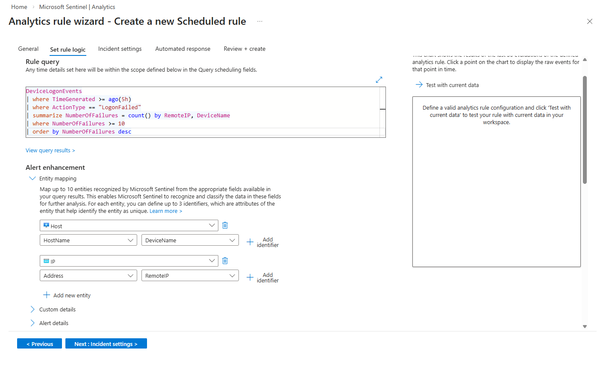
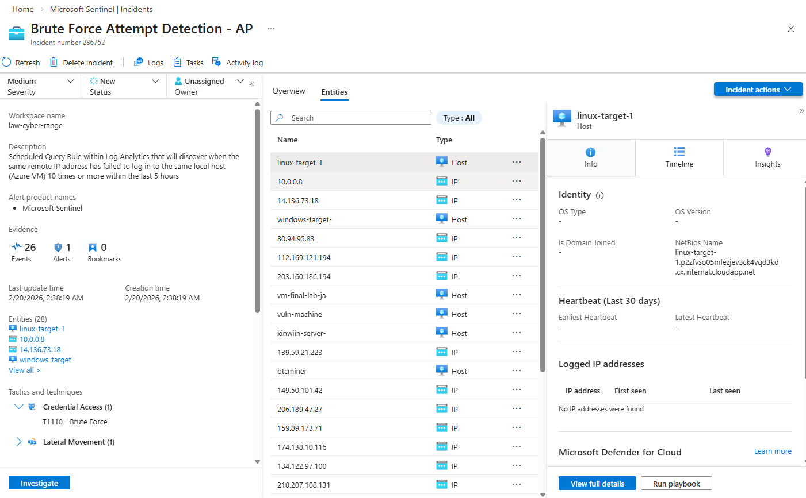
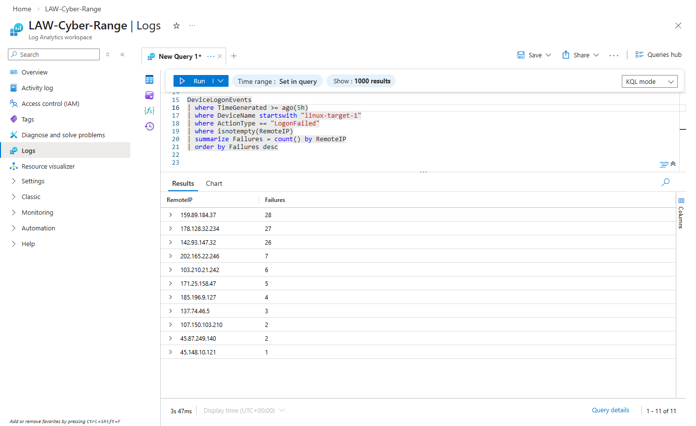
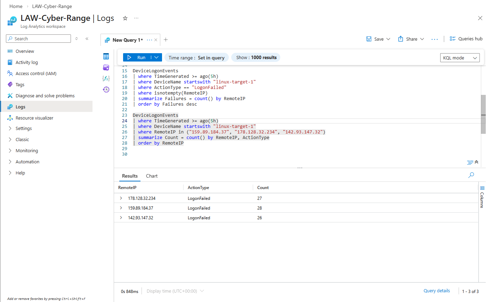
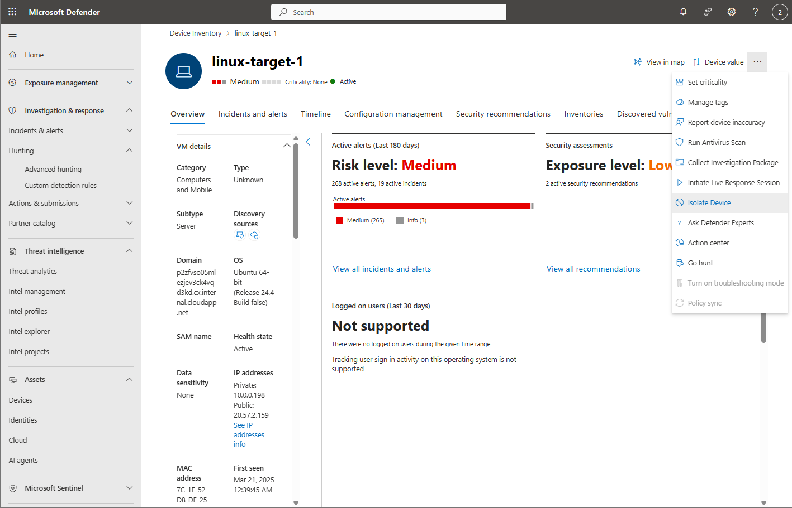
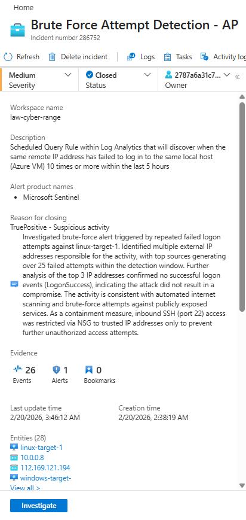

# 🛡️ Brute Force Detection & Response Lab (Microsoft Sentinel)

## 📌 Overview
This project demonstrates detecting, investigating, and responding to brute-force login attempts against a virtual machine using Microsoft Sentinel and Defender for Endpoint.

This project was conducted in a lab environment where virtual machines are intentionally exposed to the internet to observe real-world attacks and generate organic logs. The environment is isolated from production systems, allowing for safe analysis of external attack activity.

The goal was to simulate a real-world SOC workflow by identifying repeated failed login attempts, validating whether a compromise occurred, and implementing containment measures.

---

## 🔍 Detection Logic

A scheduled query rule was created in Microsoft Sentinel to identify when a single remote IP generates 10 or more failed logon attempts within a 5-hour window.

---

## 🚨 Incident Analysis

Microsoft Sentinel generated an incident based on the detection rule, mapping activity to MITRE ATT&CK technique **T1110 – Brute Force**.

The incident included multiple IP entities targeting the linux-target-1 virtual machine, indicating distributed brute-force activity.

While the incident included multiple IP and host entities, this investigation focused specifically on linux-target-1 as the primary system of interest to demonstrate a targeted analysis workflow.

---

## 📊 Identifying Suspicious Activity

Initial analysis revealed multiple external IP addresses generating repeated failed login attempts against the target system.

---

## 🧪 Investigation

The top three attacking IPs were analyzed further to determine whether any logon attempts were successful.

No successful authentication events were identified, confirming the attack did not result in a system compromise.

---

## 🛠️ Response & Containment

The investigation confirmed that no successful logon events occurred, indicating the brute-force attempts did not result in a compromise.

As a result, full system isolation was not required.

To reduce exposure and prevent further unauthorized access attempts, inbound SSH (port 22) access was restricted via a Network Security Group (NSG) to trusted IP addresses only.

For demonstration purposes, device isolation capabilities within Microsoft Defender for Endpoint were reviewed to illustrate how containment would be performed if a compromise had been detected.

---

## ✅ Incident Resolution

The incident was investigated and closed as a **True Positive**, confirming malicious brute-force activity without successful compromise.

---

## 🧠 Key Takeaways

- Built and deployed a custom detection rule in Microsoft Sentinel  
- Investigated authentication activity using KQL  
- Identified and validated brute-force attack behavior  
- Implemented containment via NSG and device isolation  
- Applied MITRE ATT&CK framework for classification  
